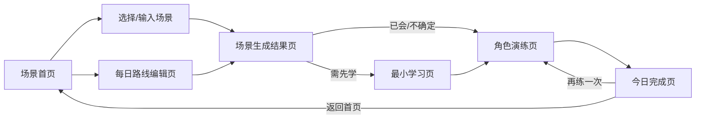

## 1. 产品概述

家庭场景英语 MVP 是一个面向家庭亲子共学的英语学习工具，帮助家长把当天真实发生的生活场景转化为孩子能听、能说、能练、能复用的英语表达。
- 主要用户：家长（操作者）；被服务对象：儿童（3-8 岁，参与者）
- 核心价值：把家庭生活里的真实场景，变成孩子马上能学、马上说、马上用的英语

## 2. 核心功能

### 2.1 用户角色

| 角色 | 说明 | 权限 |
|------|------|------|
| 家长 | 主要操作者 | 选择场景、确认内容、陪孩子学习演练、控制产品 |
| 儿童 | 参与者（无独立账号） | 听、说、跟读、角色演练、现实使用 |

### 2.2 功能模块（六个页面组成完整闭环）

1. **场景首页**：产品主标题、学习提示、临时场景输入、每日路线入口、推荐/示例场景、开始生成
2. **每日路线编辑页**：上学日生活节点（起床/刷牙/早餐/出门/上学等）、节点说明、保存路线
3. **场景生成结果页**：场景名称、场景插画、核心词汇、核心句子、简短对话、掌握判断入口、进入学习/演练、重新生成
4. **最小学习页**：场景提示、核心词汇、核心句子、图片辅助、听一听、跟读、简单任务、进入演练
5. **角色演练页**：场景、角色提示、当前轮次、家长台词、孩子回应、播放示范、录音/跟读、下一轮、完成
6. **今日完成页**：完成状态、今日场景、已学习/已练习/已使用、次日复习提示、七日迁移提示、返回首页、再练一次

### 2.3 页面详情

| 页面 | 模块 | 功能说明 |
|------|------|----------|
| 场景首页 | 临时场景输入 | 家长输入刚发生的生活场景，AI 生成英语内容 |
| 场景首页 | 推荐场景 | 展示示例场景卡片（吃黄瓜/起床/刷牙等），可点击生成 |
| 场景首页 | 每日路线入口 | 进入路线编辑页配置一天生活节点 |
| 每日路线编辑页 | 生活节点 | 展示上学日固定节点，可保存为学习路线 |
| 场景生成结果页 | 内容展示 | AI 生成的词汇/句子/对话，含中英对照 |
| 场景生成结果页 | 掌握判断 | 三选一：已会/需先学/不确定，决定下一步 |
| 最小学习页 | 听与跟读 | 播放示范音、跟读、完成识别/问答任务 |
| 角色演练页 | 三轮对话 | 家长孩子分角色，逐轮演练，播放示范 |
| 今日完成页 | 复习提示 | 次日复习 + 七日迁移到真实生活建议 |

## 3. 核心流程

家长进入首页 → 选择/输入生活场景 → AI 生成英语内容 → 家长判断孩子是否需先学 → 孩子完成最小学习 → 家长孩子完成三轮角色演练 → 展示今日完成与复习建议。

## 4. 用户界面设计

### 4.1 设计风格

- **调性**：温暖、亲子、轻松、清晰、家庭生活感；儿童友好但不过度幼稚
- **主色**：暖奶油底色 + 鼠尾草绿/暖橙作为主行动色，柔和而不刺眼
- **按钮**：大圆角、饱满、明确主行动按钮（CTA），亲子手指易点
- **字体**：标题用圆润有亲和力的展示字体，正文用清晰易读字体；英文学习内容用清晰无衬线
- **布局**：卡片式、留白充足、每页突出一个主任务、不拥挤、不像后台
- **插画**：每个场景配温暖手绘风插画辅助理解
- **图标**：柔和线性/圆角图标，避免冷硬工程图标

### 4.2 页面设计概览

| 页面 | 模块 | UI 元素 |
|------|------|----------|
| 场景首页 | Hero | 暖色渐变背景、主标题、学习提示卡、场景输入框、推荐场景卡片网格、主 CTA |
| 每日路线编辑页 | 路线时间轴 | 纵向时间轴节点卡、节点说明、保存按钮 |
| 场景生成结果页 | 内容卡 | 场景插画、词汇卡、句子卡、对话卡、三选一判断按钮组 |
| 最小学习页 | 学习卡 | 词汇图卡、句子卡、播放/跟读按钮、任务确认、进入演练 CTA |
| 角色演练页 | 对话舞台 | 角色头像、当前轮次进度、台词气泡、播放/录音按钮、下一轮/完成 |
| 今日完成页 | 完成卡 | 完成插画、学习/练习/使用状态、复习提示卡、返回/再练按钮 |

### 4.3 响应式

桌面优先（家庭场景多为家长在桌前/平板陪孩子），移动端自适应（单列堆叠、按钮放大、触控友好）。

## 5. 样本内容

默认样本：吃黄瓜（Eating Cucumber）
- 核心词汇：cucumber / eating / crunchy / like
- 核心句型：What are you eating? / I'm eating a cucumber. / Is it crunchy? / Yes, it is. / Do you like it? / Yes, I do. / No, I don't.
- 三轮对话围绕吃黄瓜展开

## 6. 范围外（不做）

儿童独立账号、双端体系、登录注册、会员支付、后台管理、多儿童管理、课程商城、社区、排行榜、大型课程体系、开放 AI 聊天、自由对话、完整 LMS、原生 App、推送通知、离线学习。

## 7. 验收标准

- 六个页面均存在且路由正确，组成完整闭环
- 视觉符合家庭亲子定位，使用真实界面元素非截图
- 核心样本内容完整，家长能理解怎么用，孩子能理解做什么
- 语音为自然语音，端口固定 7500
