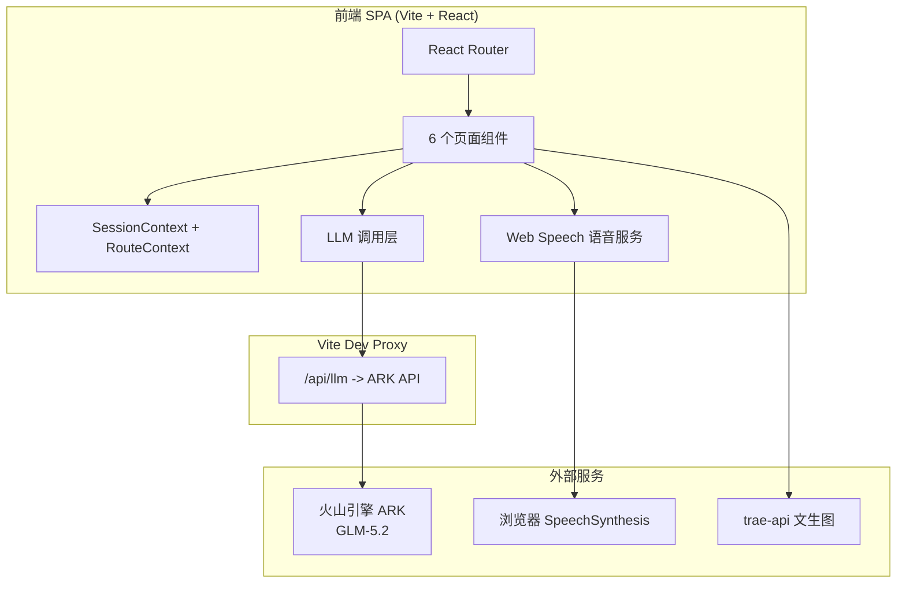

## 1. 架构设计

纯前端单页应用，无后端。AI 调用通过 Vite 开发代理转发至火山引擎 ARK，避免 CORS 并隐藏 API Key。会话与路线数据存 localStorage。



## 2. 技术说明

- **前端**：React 18 + TypeScript + Vite
- **样式**：Tailwind CSS v3 + shadcn/ui（v0.4 Canonical 风格）
- **路由**：React Router v6
- **状态**：React Context + localStorage 持久化
- **语音**：浏览器 Web Speech API（SpeechSynthesis），自动优先选择自然语音
- **AI**：火山引擎 ARK，模型 glm-5.2，OpenAI 兼容接口
- **初始化工具**：vite-init (react-ts 模板)
- **后端**：无
- **数据库**：无（localStorage）
- **端口**：固定 7500

## 3. 路由定义

| 路由 | 页面 | 说明 |
|------|------|------|
| `/` | 场景首页 | 输入/选择场景，开始生成 |
| `/daily-route` | 每日路线编辑页 | 配置上学日生活节点 |
| `/scene-result` | 场景生成结果页 | 展示 AI 生成内容，判断掌握 |
| `/learn` | 最小学习页 | 词汇/句子听与跟读 |
| `/practice` | 角色演练页 | 三轮角色对话演练 |
| `/done` | 今日完成页 | 完成状态与复习提示 |

## 4. API 定义

### 4.1 LLM 调用（经 Vite 代理）

**请求**：`POST /api/llm/chat/completions`
- 代理目标：`https://ark.cn-beijing.volces.com/api/coding/v3/chat/completions`
- 代理自动注入 `Authorization: Bearer <ARK_KEY>`
- 请求体（OpenAI 兼容）：
```typescript
{
  model: "glm-5.2",
  temperature: 0.4,
  messages: [
    { role: "user", content: "<场景生成 prompt>" }
  ]
}
```

**响应**：OpenAI 兼容 chat.completion，取 `choices[0].message.content` 为 JSON 字符串（需剥离 markdown 代码块）。

### 4.2 场景内容生成 Schema

```typescript
interface SceneContent {
  sceneNameZh: string;      // 场景中文名
  sceneNameEn: string;      // 场景英文名
  vocab: Array<{
    word: string;           // 英文词
    meaningZh: string;      // 中文释义
    ipa: string;            // 音标
  }>;
  coreSentences: Array<{
    en: string;             // 英文句子
    zh: string;             // 中文翻译
  }>;
  dialogue: Array<{
    round: number;          // 轮次
    parent: string;         // 家长英文台词
    child: string;          // 孩子英文回应
    parentZh: string;       // 家长中文
    childZh: string;        // 孩子中文
  }>;
}
```

### 4.3 Prompt 策略

- 场景名前置 + 强制约束（禁止更换场景）
- 低温（0.4）保证稳定
- 要求纯 JSON 输出
- 前端做容错：剥离 ```json 代码块、截断词汇至 4 个、对话至 3 轮

## 5. 数据模型

### 5.1 会话数据（localStorage）

```typescript
interface LearnSession {
  id: string;                       // 会话 ID
  sceneInput: string;               // 家长输入的场景描述
  source: 'input' | 'example' | 'route'; // 场景来源
  content: SceneContent;            // AI 生成内容
  mastery: 'known' | 'need-learn' | 'unsure' | null; // 掌握判断
  learnedDone: boolean;             // 是否完成最小学习
  practiceRound: number;            // 演练当前轮次
  practiceDone: boolean;            // 是否完成演练
  createdAt: number;                // 创建时间
}
```

### 5.2 每日路线（localStorage）

```typescript
interface DailyRoute {
  nodes: Array<{
    id: string;
    nameZh: string;        // 节点名（起床/刷牙/早餐...）
    nameEn: string;        // 英文
    desc: string;          // 简短说明
    time: string;          // 时段标签
  }>;
  updatedAt: number;
}
```

### 5.3 会话串联规则

- 从场景生成结果页起，四页（结果/学习/演练/完成）共享同一 session
- 进入学习/演练/完成页时校验 session 存在，缺失则提示返回首页
- 完成页可"再练一次"回到演练页，"返回首页"清空当前 session

## 6. 语音服务设计

- 使用 `window.speechSynthesis`
- 启动时枚举 `getVoices()`，按优先级筛选英文自然语音：
  1. 名称含 "Google US English"
  2. 名称含 "Natural" / "Enhanced" / "Premium"
  3. lang 为 en-US 的非默认语音
  4. 兜底任意 en 语音
- 提供音色下拉选择（家长可切换）
- 语音失败/不可用时不阻断流程，仅提示
- 不做语音识别评分（MVP 边界）

## 7. 插画方案

- 场景插画使用 trae-api 文生图：`https://trae-api-cn.mchost.guru/api/ide/v1/text_to_image?prompt=<encoded>&image_size=<size>`
- 风格：温暖手绘风、家庭生活场景、儿童友好
- 每个核心场景生成一张插画
